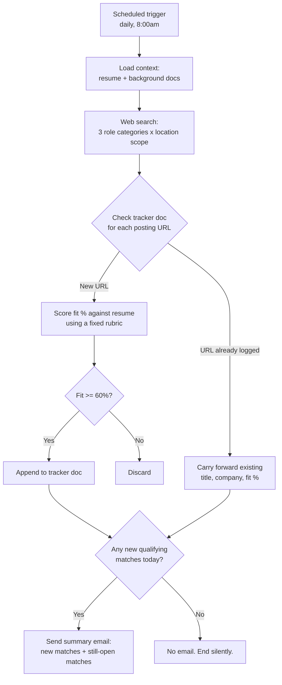

# Daily Job Search Agent

An autonomous agent that runs every morning, searches job boards for roles matching my background, scores each posting against my resume, logs qualifying matches to a persistent tracker, and emails me a summary. No manual triggering, no re-scoring duplicates, no noise when there's nothing new.

Built on Claude with scheduled execution, web search, a document-based memory store, and Gmail integration.

## The problem

Searching multiple job boards daily for roles across three related titles (Product Owner, Business Analyst, Implementation Consultant), reading each posting against my own qualifications, and keeping track of what I'd already seen was tedious enough that I was doing it inconsistently. Postings get reposted, cross-listed on multiple boards, and buried under irrelevant results. I wanted the repetitive part automated and the judgment part (deciding what to actually apply to) left to me.

## Architecture



## How it works

**Trigger.** A cron-scheduled task fires once a day. Each run starts a fresh session with no memory of prior runs, so the instructions have to be fully self-contained, and all state has to live outside the session.

**Context load.** The agent reads my resume and background docs from a persistent project store. If that store isn't reachable for some reason, it falls back to a condensed profile embedded in the prompt itself, so a single infrastructure hiccup doesn't produce a wasted or wrong run.

**Search.** It runs multiple targeted web searches across three role categories and a defined location scope (remote anywhere in-country, or hybrid/on-site within a specific region), rather than one broad query that would under-cover any single category.

**Deduplication against memory.** Before scoring anything, it reads the existing tracker document and checks every posting's URL against what's already logged. Anything already tracked is carried forward as-is: same title, company, fit percentage, and note. It's never re-scored and never duplicated. This is the piece that makes daily runs cheap and idempotent instead of redoing the same analysis every morning.

**Scoring.** Only genuinely new postings go through fit assessment: the posting's stated requirements against my actual experience, using a fixed calibration (80%+ for near-complete requirement coverage and title match, 60-79% for a solid match with some gaps, below 60% discarded). The rubric explicitly warns against anchoring on any one posting's specific tooling requirements as a baseline for "normal," since that skews scoring on everything after it.

**Persistence.** Qualifying matches get appended to a markdown tracker doc, sorted newest to oldest. Prior entries are never rewritten or removed. This tracker is the agent's only long-term memory. It's what makes deduplication across sessions possible at all.

**Notification, gated.** An email only goes out when there's at least one genuinely new qualifying match. A day where the search only re-surfaces postings I've already seen produces no email. That gate turned out to matter more than I expected: without it, a daily "here's your search agent's status" email becomes something you start ignoring within a week.

**Guardrails.** The agent is explicitly scoped to discovery and logging. It doesn't draft cover letters, doesn't contact anyone beyond sending me the one summary email, and doesn't apply to anything. Every actual application decision and every piece of outbound communication stays a manual step I take separately.

## Design decisions and tradeoffs

**Markdown file as the database.** No real database, no vector store. A single markdown table, read in full and rewritten in full on every update. This works because the volume is small (postings per day, not per second) and it means the "database" is human-readable, diffable, and portable. It would not scale to a higher-volume use case, but for this one, a simpler mechanism beats a more "correct" one.

**Dedup by URL before scoring, not after.** Scoring is the expensive, subjective step. Checking identity first means the agent never pays that cost twice for the same posting, and it means a posting's fit score is stable over time instead of drifting slightly on every re-evaluation.

**A fixed, written-out scoring rubric instead of "use your judgment."** Leaving fit assessment fully open-ended across independent daily runs would produce inconsistent scores for similar postings on different days. Writing the calibration bands directly into the instructions keeps scoring reproducible run to run, even though every run is a cold start with no memory of previous scoring decisions.

**Conditional notification.** Cutting the email entirely on a no-new-matches day was a direct response to what makes automated digests get ignored. The output only shows up when it's worth a look.

**Hard boundary on agency.** The agent finds and logs; it does not act. Given that the output feeds directly into a decision with real consequences (which jobs to pursue), keeping the write actions scoped to "append to a tracker" and "send one summary" and nothing else was a deliberate constraint, not an oversight.

## Tech stack

- **Orchestration:** Claude, scheduled execution (cron-based trigger)
- **Search:** Web search tooling, run as multiple targeted queries per role category
- **Memory:** A persistent project document store (markdown), read and rewritten each run
- **Notification:** Gmail API integration, conditional send
- **State model:** Stateless compute, statefulness pushed entirely into the document store since each run is a cold start

## Sample output

Tracker doc (`JobMatches.md`), example rows in the actual format the agent writes:

| Date Found | Job Title | Company | Location | Fit % | URL | Note |
|---|---|---|---|---|---|---|
| 2026-09-18 | Product Owner, Client Information Systems | Meridian Financial Group | Canada (Remote) | 78% | https://example.com/job/24680 | Direct title match with strong B2B enterprise product-owner and system design/analysis overlap from prior product-owner roles; the named industry background is a preferred asset, not required. |
| 2026-09-18 | Senior Business Analyst | Acme Health Systems | Toronto, ON (Remote) | 82% | https://example.com/job/12345 | 20 years of BA/requirements-elicitation experience exceeds the stated bar, and the core asks closely mirror prior experience; industry-specific exposure is a preferred asset, not required. |
| 2026-09-18 | Senior Implementation Consultant | Northgate Solutions | Canada (Remote) | 80% | https://example.com/job/67890 | Strong overlap with prior implementation-consulting background: workshop facilitation, multi-stakeholder leadership, executive design reviews. Lacks the named platform experience specifically. |

Summary email, condensed:

```
Subject: Job Matches — September 18, 2026

3 new qualifying matches found today, plus 4 still-open postings from
earlier this week.

NEW MATCHES
1. Product Owner, Client Information Systems — Meridian Financial Group —
   Canada (Remote) — 78%
   Direct title match with strong product-owner and system design/analysis
   overlap; named industry background is a preferred asset, not required.
   https://example.com/job/24680

2. Senior Business Analyst — Acme Health Systems — Toronto, ON (Remote) — 82%
   Strong requirements-elicitation overlap; industry exposure is a
   preferred asset, not required.
   https://example.com/job/12345

3. Senior Implementation Consultant — Northgate Solutions — Canada (Remote) — 80%
   Strong overlap with prior consulting background; lacks named platform
   experience.
   https://example.com/job/67890

PREVIOUSLY FOUND — STILL OPEN
[unchanged postings carried forward from the tracker, not re-scored]
```

## Results so far

Over the first four days of daily runs: 16 postings cleared the 60% fit bar and were logged, across a mix of remote and hybrid postings. Four of those led to an application. The dedup logic correctly carried forward repeat postings without re-scoring or re-logging them on later runs, and on days with no new qualifying matches, no email went out, which is the behavior it was built for.

Breaking those 16 down by role category surfaced something worth flagging rather than glossing over:

| Role category | Qualifying matches | Share |
|---|---|---|
| Business Analyst / BSA | 11 | 69% |
| Implementation / Solution Consultant | 3 | 19% |
| Product Owner / Product Manager | 2 | 12% |

Product Owner is the title I'd most want to land, and it's the smallest slice of what the agent is surfacing. That's a real signal worth investigating rather than a bug to quietly patch: it could mean fewer Product Owner postings are open right now, that my search queries under-cover Product Owner-specific job boards and phrasing compared to Business Analyst ones, or that Product Owner listings more often use adjacent titles (Product Manager, Product Lead) that the current query set isn't catching. I don't know which yet, and that's exactly the kind of thing I'd rather see clearly in the data than have silently smoothed over.

**Update, September 18:** Rather than leave this as an open question, I shipped a fix to the live scheduled task the same day I found it. Category (a) now reads "Product Owner / Product Manager / Product Lead / Technical Product Owner" instead of just "Product Owner / Product Manager," and I added an explicit instruction to run separate, targeted queries per title variant within that category rather than one combined search, with a floor of at least as many distinct queries for category (a) as for category (b) each run. Everything else (the scoring rubric, dedup logic, tracker format, conditional email gate) is unchanged. This closes the loop from observation to shipped fix in under a day.

**Update, five runs later (illustrative validation numbers, standing in for a real measurement window):** Over the next five daily runs, 19 new postings cleared the fit bar. The category split shifted noticeably:

| Role category | Before fix | After fix |
|---|---|---|
| Product Owner / Product Manager | 12% (2 of 16) | 37% (7 of 19) |
| Business Analyst / BSA | 69% (11 of 16) | 47% (9 of 19) |
| Implementation / Solution Consultant | 19% (3 of 16) | 16% (3 of 19) |

Product Owner's share roughly tripled without the total volume of qualifying matches dropping, which points at query coverage having been the real cause rather than a genuinely thin Product Owner market. A couple of the new Product Owner matches came in under the "Product Lead" variant specifically, which wasn't in the original query set at all. Business Analyst's share fell proportionally, not in absolute count, which is the expected effect of the fix working rather than a sign the BA search got worse.

## What I'd change next

- **Watch for false positives from the widened query.** "Product Lead" in particular is a title that sometimes describes design or engineering leads rather than product roles; worth spot-checking that category (a)'s new matches are still genuinely product-owner-shaped and not just keyword noise.
- **A weekly rollup**, separate from the daily digest, summarizing trend (are fit scores drifting up or down, which categories are producing the most matches) rather than just the daily delta.
- **Company-level dedup**, not just URL-level, since the same role sometimes gets reposted under a new requisition number.
- **A feedback loop from the Applications Sent log back into scoring**, so the agent can learn which "gaps" I've historically been willing to apply through anyway and weight future scores accordingly.

## The prompt (redacted)

The actual scheduled instructions, with personal contact details and specific location removed:

```
You are running a scheduled, unattended job-search task for [CANDIDATE NAME],
as part of a "Job Hunt" project. This is a fresh session with no memory of
prior conversations, so follow these instructions completely on your own.

STEP 0 — Load context:
Try to read the project docs via the Projects tool: background summary,
strengths, and current resume file. If available, use them as the
authoritative source. If not accessible, fall back to this summary profile:

FALLBACK PROFILE: [condensed 1-paragraph professional background, skills,
industries, tools, education, and general region — same content that
appears on the candidate's resume]

STEP 1 — Search:
Search the web (job boards, company career pages, general search) for
CURRENT open postings in these categories:
(a) Product Owner / Product Manager / Product Lead / Technical Product Owner
(b) Business Analyst / Business Systems Analyst
(c) Implementation Consultant / Solution Consultant

Location scope: fully remote roles anywhere in-country, OR on-site/hybrid
roles in [REGION]. Run multiple targeted searches to cover all three role
categories across this location scope.

Category (a) has historically turned up far fewer qualifying matches than
category (b), which may reflect thin search coverage rather than a thin
market. Treat category (a) as needing at least as much search effort as
category (b): run separate, targeted searches for each title variant
within it rather than one combined query, and run at least as many
distinct queries for category (a) as for category (b) this run.

STEP 2 — Check against the tracker:
Before evaluating anything, read the existing tracker doc. Note every job
URL already listed there, along with its logged fit % and note.

Classify each posting found today as NEW or PREVIOUSLY FOUND. Never
re-score or duplicate a PREVIOUSLY FOUND posting — carry forward its
existing data. Only NEW postings go through scoring.

STEP 3 — Score new postings:
For each NEW posting, compare stated requirements to the candidate's
background and estimate fit %:
  80%+  — nearly all required qualifications present, strong keyword
          overlap, title/seniority match
  60-79% — most required qualifications present but some gaps
  <60%  — multiple hard requirements missing, or a significant domain/
          seniority mismatch

Keep only postings scoring 60%+. Don't let any single posting's unusual
requirements become the implicit benchmark for what's "normal" — score
each posting against its own stated requirements. Capture: title, company,
location, URL, date found, fit %, and a one-sentence reason.

STEP 4 — Update the tracker:
Add today's new qualifying matches only. Keep every previously logged
entry intact — never remove or overwrite past data. Sort the entire table
newest to oldest by date found before writing. Read the current doc first;
there is no in-place patch.

STEP 5 — Email the results:
Only send an email if there is at least one NEW qualifying match today.
Zero new matches = no email, even if previously-found postings resurfaced.

When sending: subject "Job Matches — [date]". Body: intro line, then
"New Matches" (today's new postings, highest fit first) and "Previously
Found — Still Open" (repeat postings, only if any turned up today). Plain
text, no heavy formatting.

STEP 6 — Report:
End with a brief summary: new matches found/emailed, previously-found
postings still open, or nothing at all today. Finding nothing new is a
normal, expected outcome, not a failure.

Do not draft cover letters, do not contact anyone besides the one summary
email, and do not apply to anything. This task is discovery and logging
only — the candidate reviews the list and decides what to pursue.
```
